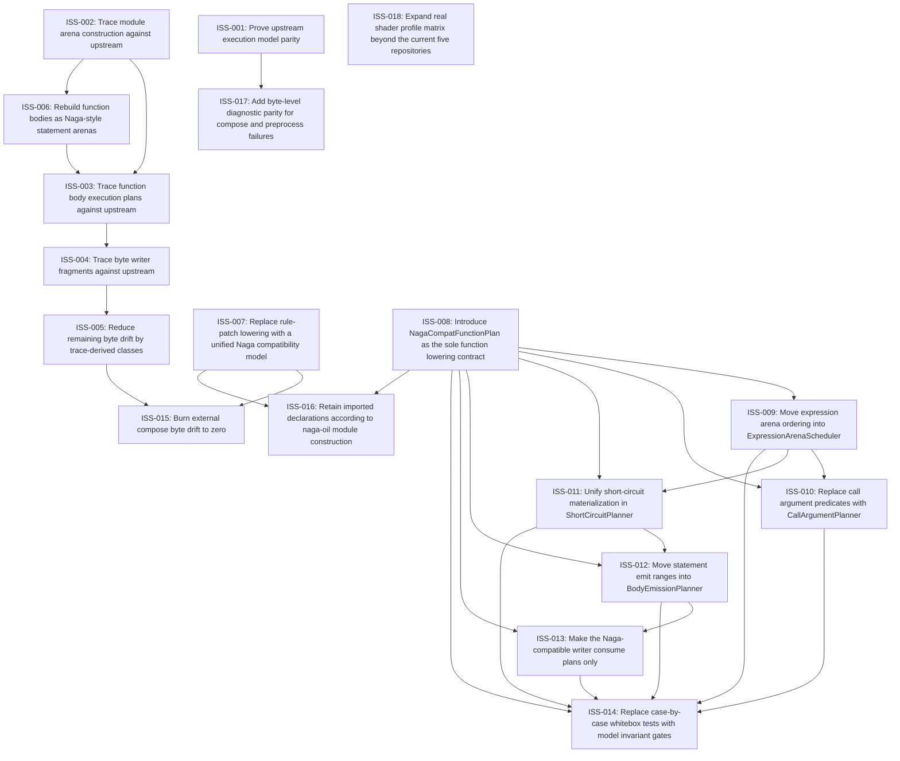

# Markdown Issue Index

Generated by derive-tracker.wasm

## Ready Queue

| ID | Priority | Type | Assignee | Title | Labels |
| --- | ---: | --- | --- | --- | --- |
| [ISS-007](ISS-007.md) | 0 | epic | unassigned | Replace rule-patch lowering with a unified Naga compatibility model | area/ir, area/parity, architecture, agent |
| [ISS-008](ISS-008.md) | 0 | task | unassigned | Introduce NagaCompatFunctionPlan as the sole function lowering contract | area/ir, architecture, lowering, agent |
| [ISS-001](ISS-001.md) | 1 | epic | unassigned | Prove upstream execution model parity | area/parity, area/naga-writer, agent |
| [ISS-018](ISS-018.md) | 2 | task | unassigned | Expand real shader profile matrix beyond the current five repositories | area/corpus, area/testing, area/profiles, agent |

## Unresolved Issues

| ID | Status | Priority | Type | Assignee | Blocked by | Blocks | Title |
| --- | --- | ---: | --- | --- | --- | --- | --- |
| [ISS-005](ISS-005.md) | in_progress | 1 | task | unassigned | none | ISS-015 | Reduce remaining byte drift by trace-derived classes |
| [ISS-007](ISS-007.md) | open | 0 | epic | unassigned | none | ISS-015, ISS-016 | Replace rule-patch lowering with a unified Naga compatibility model |
| [ISS-008](ISS-008.md) | open | 0 | task | unassigned | none | ISS-009, ISS-010, ISS-011, ISS-012, ISS-013, ISS-014, ISS-016 | Introduce NagaCompatFunctionPlan as the sole function lowering contract |
| [ISS-009](ISS-009.md) | open | 0 | task | unassigned | ISS-008 | ISS-010, ISS-011, ISS-014 | Move expression arena ordering into ExpressionArenaScheduler |
| [ISS-010](ISS-010.md) | open | 0 | task | unassigned | ISS-008, ISS-009 | ISS-014 | Replace call argument predicates with CallArgumentPlanner |
| [ISS-011](ISS-011.md) | open | 0 | task | unassigned | ISS-008, ISS-009 | ISS-012, ISS-014 | Unify short-circuit materialization in ShortCircuitPlanner |
| [ISS-015](ISS-015.md) | open | 0 | task | unassigned | ISS-005, ISS-007 | none | Burn external compose byte drift to zero |
| [ISS-016](ISS-016.md) | open | 0 | task | unassigned | ISS-007, ISS-008 | none | Retain imported declarations according to naga-oil module construction |
| [ISS-001](ISS-001.md) | open | 1 | epic | unassigned | none | ISS-017 | Prove upstream execution model parity |
| [ISS-012](ISS-012.md) | open | 1 | task | unassigned | ISS-008, ISS-011 | ISS-013, ISS-014 | Move statement emit ranges into BodyEmissionPlanner |
| [ISS-013](ISS-013.md) | open | 1 | task | unassigned | ISS-008, ISS-012 | ISS-014 | Make the Naga-compatible writer consume plans only |
| [ISS-014](ISS-014.md) | open | 1 | task | unassigned | ISS-008, ISS-009, ISS-010, ISS-011, ISS-012, ISS-013 | none | Replace case-by-case whitebox tests with model invariant gates |
| [ISS-017](ISS-017.md) | open | 1 | task | unassigned | ISS-001 | none | Add byte-level diagnostic parity for compose and preprocess failures |
| [ISS-018](ISS-018.md) | open | 2 | task | unassigned | none | none | Expand real shader profile matrix beyond the current five repositories |

## Dependency Graph

## Warnings

None.

