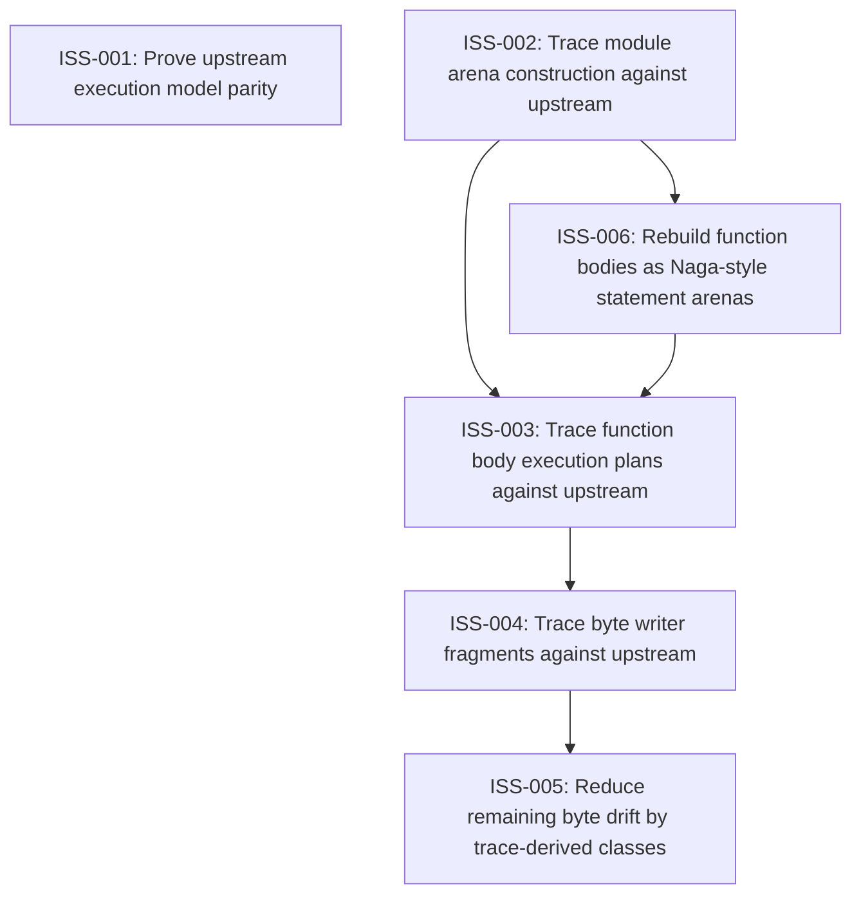

# Markdown Issue Index

Generated by derive-tracker.wasm

## Ready Queue

| ID | Priority | Type | Assignee | Title | Labels |
| --- | ---: | --- | --- | --- | --- |
| [ISS-001](ISS-001.md) | 1 | epic | unassigned | Prove upstream execution model parity | area/parity, area/naga-writer, agent |

## Unresolved Issues

| ID | Status | Priority | Type | Assignee | Blocked by | Blocks | Title |
| --- | --- | ---: | --- | --- | --- | --- | --- |
| [ISS-005](ISS-005.md) | in_progress | 1 | task | unassigned | none | none | Reduce remaining byte drift by trace-derived classes |
| [ISS-001](ISS-001.md) | open | 1 | epic | unassigned | none | none | Prove upstream execution model parity |

## Dependency Graph

## Warnings

None.

