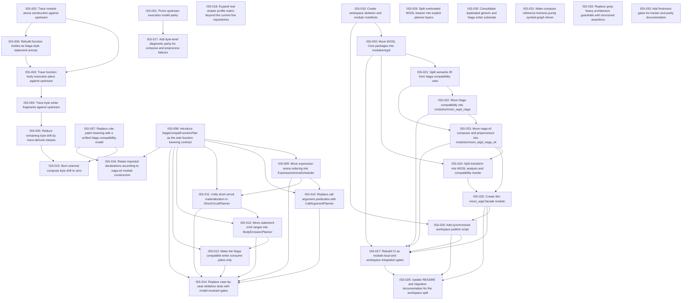

# Markdown Issue Index

Generated by derive-tracker.wasm

## Ready Queue

| ID | Priority | Type | Assignee | Title | Labels |
| --- | ---: | --- | --- | --- | --- |
| [ISS-030](ISS-030.md) | 1 | task | unassigned | Consolidate duplicated generic and Naga writer substrate | area/writer, area/naga, area/wgsl-core, architecture, agent |
| [ISS-031](ISS-031.md) | 1 | epic | unassigned | Make compose reference liveness purely symbol-graph driven | area/compose, area/naga-oil, area/symbol-graph, architecture, agent |
| [ISS-032](ISS-032.md) | 2 | task | unassigned | Replace grep-heavy architecture guardrails with structured assertions | area/ci, area/tooling, architecture, agent |
| [ISS-033](ISS-033.md) | 2 | chore | unassigned | Add freshness gates for tracker and parity documentation | area/docs, area/tooling, area/testing, agent |

## Unresolved Issues

| ID | Status | Priority | Type | Assignee | Blocked by | Blocks | Title |
| --- | --- | ---: | --- | --- | --- | --- | --- |
| [ISS-030](ISS-030.md) | open | 1 | task | unassigned | none | none | Consolidate duplicated generic and Naga writer substrate |
| [ISS-031](ISS-031.md) | open | 1 | epic | unassigned | none | none | Make compose reference liveness purely symbol-graph driven |
| [ISS-032](ISS-032.md) | open | 2 | task | unassigned | none | none | Replace grep-heavy architecture guardrails with structured assertions |
| [ISS-033](ISS-033.md) | open | 2 | chore | unassigned | none | none | Add freshness gates for tracker and parity documentation |

## Dependency Graph

## Warnings

None.

