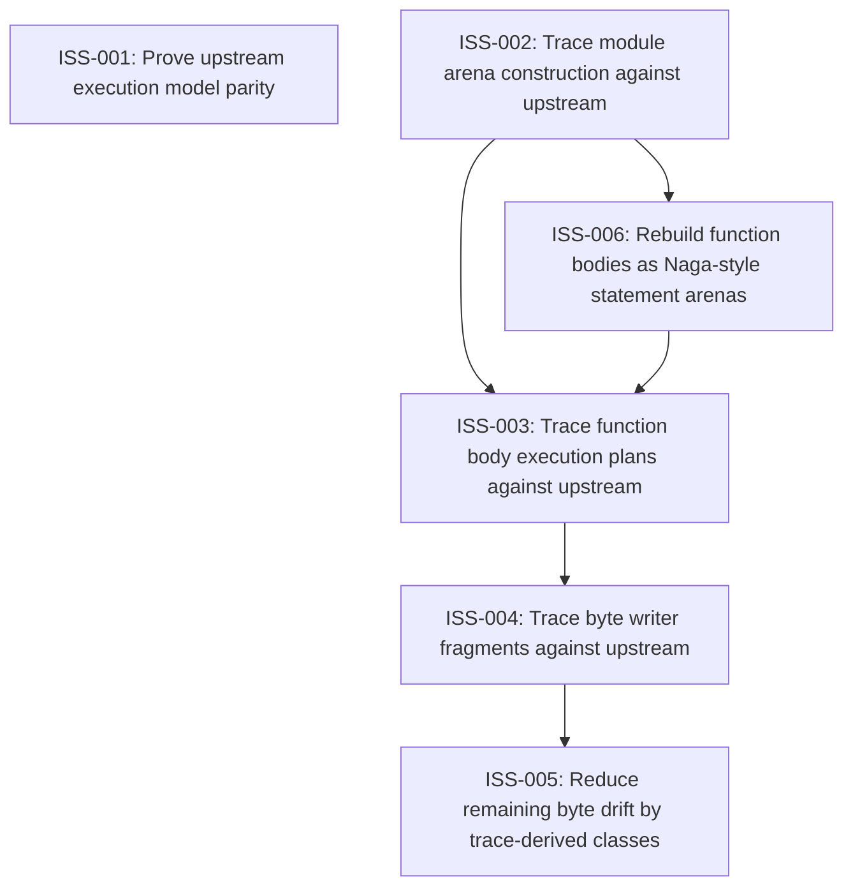

# Markdown Issue Index

Generated by derive-tracker.wasm

## Ready Queue

| ID | Priority | Type | Assignee | Title | Labels |
| --- | ---: | --- | --- | --- | --- |
| [ISS-001](ISS-001.md) | 1 | epic | unassigned | Prove upstream execution model parity | area/parity, area/naga-writer, agent |
| [ISS-006](ISS-006.md) | 1 | task | unassigned | Rebuild function bodies as Naga-style statement arenas | area/parity, area/function-arena, area/lowering, agent |

## Unresolved Issues

| ID | Status | Priority | Type | Assignee | Blocked by | Blocks | Title |
| --- | --- | ---: | --- | --- | --- | --- | --- |
| [ISS-001](ISS-001.md) | open | 1 | epic | unassigned | none | none | Prove upstream execution model parity |
| [ISS-003](ISS-003.md) | blocked | 1 | task | unassigned | ISS-006 | ISS-004 | Trace function body execution plans against upstream |
| [ISS-004](ISS-004.md) | open | 1 | task | unassigned | ISS-003 | ISS-005 | Trace byte writer fragments against upstream |
| [ISS-005](ISS-005.md) | open | 1 | task | unassigned | ISS-004 | none | Reduce remaining byte drift by trace-derived classes |
| [ISS-006](ISS-006.md) | open | 1 | task | unassigned | none | ISS-003 | Rebuild function bodies as Naga-style statement arenas |

## Dependency Graph

## Warnings

None.

